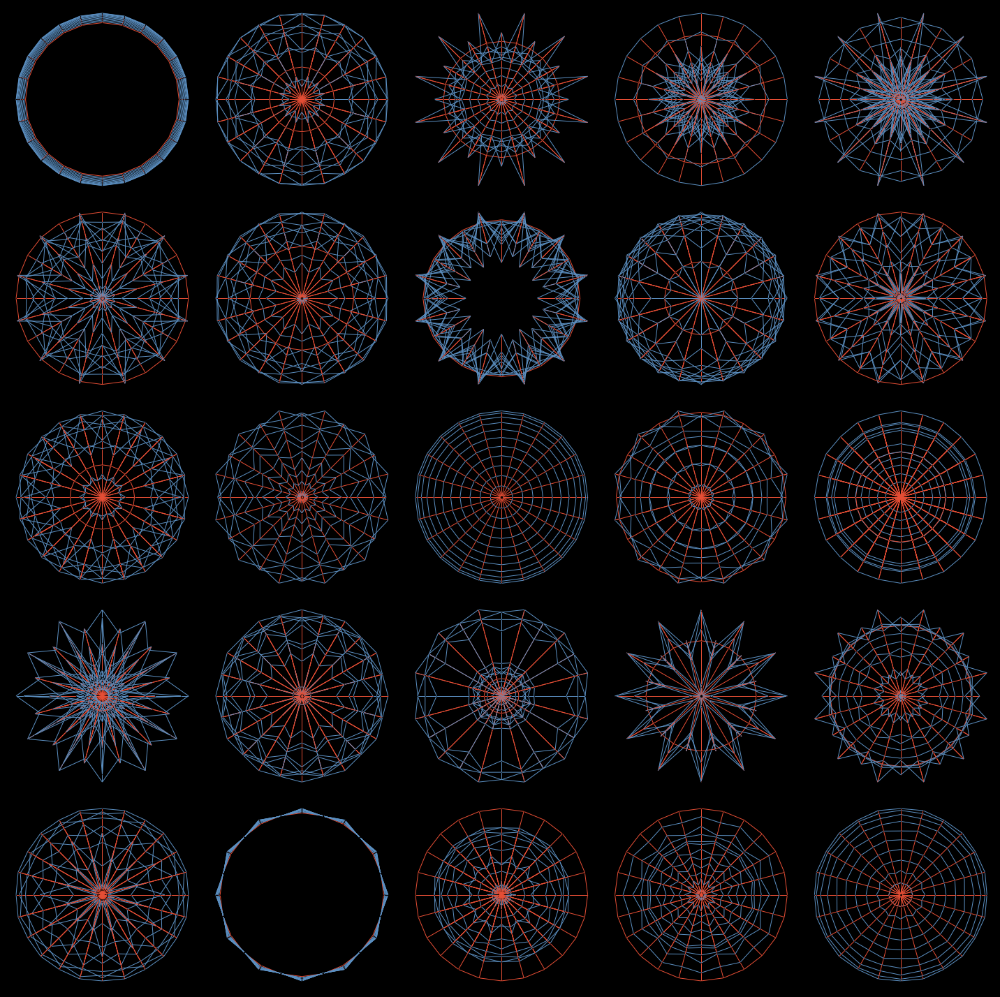

# Force_Density_Method
An implementation of Force Density Method (FDM) in Python

**Implemented by :** [Vahid Moosavi](https://www.vahidmoosavi.me)

- Implementation is the same as described in Schek (1974). 
- 	Schek, H. J. (1974). The force density method for form finding and computation of general networks. Computer methods in applied mechanics and engineering, 3(1), 115-134.

- Works easily with mesh based structures or graphs (in Networkx format)
- As shown in examples, can be mixed with any machine learning algorithms, optimization methods (either graident based or evolutionary strategies.)

- Look at the examples [here](https://nbviewer.jupyter.org/github/sevamoo/Force_Density_Method/tree/master/) 

- Some sample results:
	- Meshed shell structures 
	
	- Parametrizing the force densities based on network centrality measures
	
	
	 

	- A case of roof where the fixed nodes are on a circle with fixed radius.
	

	- Clustering of 10K generated geometries based on the distribution of forces, edge lengts and loadpaths.
	 

* For more information, you can contact me via sevamoo@gmail.com or svm@arch.ethz.ch